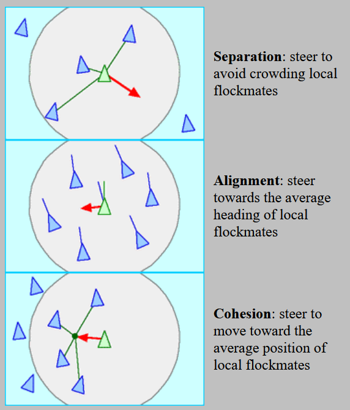
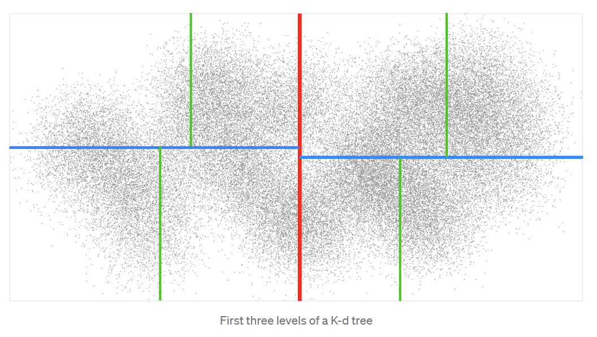

## A javascript particle model of schooling behaviour

 This is a model sandbox I created to help visualize the three major determinants involved in flocking, herding, schooling, shoaling, and swarming behaviour in nature. 
 The main motivation is to explore the effect of schooling / shoaling in fish and the effect that has on fishing catch per unit effort over time and consumption by predators over time. 
 I hope eventually to explore the effect of reduced size of individual fish on time spent foraging by predators. 
 
 Today's browsers and javascript web libraries are powerful but currently under-utilized (in the sciences) out-of-the-box user interfaces. I'm motivated to explore how to tap that potential. 
 I found it really appealing that the simulation here can be run offline, but still use the browser. All that's required to do that is to pre-download the javascript libraries referenced in the main html file. 
 
 The model is inspired by the influential study by [Reynolds (1987)](https://www.red3d.com/cwr/papers/1987/boids.html). 
 Reynolds broke apart this behaviour into three components: separation, alignment, and cohesion. 
 
 
 The project is coded in javascript with the [d3](https://d3js.org/) library and heavily relied on: 
 - [Vladimir Agafonkin's work](https://blog.mapbox.com/a-dive-into-spatial-search-algorithms-ebd0c5e39d2a) at MapBox on speeding up spatial k-nearest neighbour searches using [k-dtrees, r-trees, and quadtrees](https://github.com/mourner/kdbush)
 - The basic 'static' simulation of [Kai / stigmatic on github](http://bl.ocks.org/syntagmatic/5107530)
 
 On modern systems and browsers it isn't a problem to simulate the movement of millions of individual particles. However, it is problematic to find the nearest neighbour and to simulate collisions between said particles. 
 This is because the neighbour search is essentially a problem proportional to the square of the number of particles (O(n^2)). 
 To speed up the neighbour search, the search space can be indexed and reduced using a kind of spatial tracking system - at least that's how I think of it. 
 Consider the problem of finding nearest neighbours as (1) checking the coordinates of nearby particles, (2) computing the distamces, and (3) finding the particle at a minimum distance. 
 This involves querying the stored positions of all 'potential neighbours'. What 'trees' help with is, reducing the number of 'potential neighbours' using a smart indexing system. 
  
 
 ## Notes
 - I didn't initially consider leveraging WebGL and thus programmed this quite simply in d3.js. WebGL may have potential but my understanding is the main computational bottleneck is the nearest-neighbours search, not the shading and rendering of imagery. So, I tackled the nearest neighbour / flocking-herding-schooling problem first 
 
 ### References
 Reynolds, C. W. (1987) Flocks, Herds, and Schools: A Distributed Behavioral Model, in Computer Graphics, 21(4) (SIGGRAPH '87 Conference Proceedings) pages 25-34.
 https://www.red3d.com/cwr/papers/1987/boids.html
 
 
 
 http://bl.ocks.org/syntagmatic/5107530
 
 
